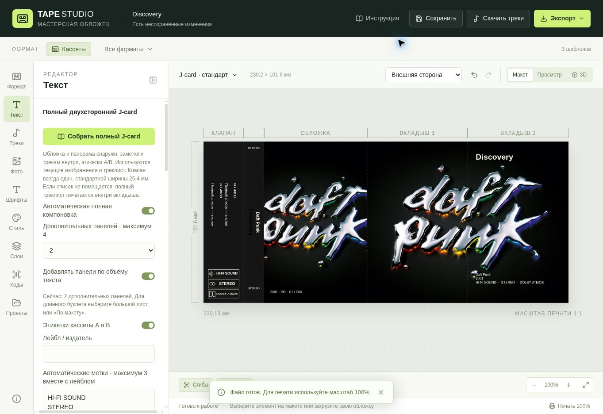

#  Tape Studio

Редактор кассетных J-card, вкладышей и этикеток. Самостоятельная статическая версия для GitHub Pages.

[Открыть мастерскую](https://igneelhd.github.io/tape-studio/)

## Скриншоты

Внешняя сторона: обложка, корешок, стандартный клапан и дополнительные панели.



Оборот J-card всегда белый. Дополнительные панели не создаются.


## Запуск

Требуется Node.js 22.13 или новее.

```sh
npm install
npm run dev
```

Для сборки: `npm run build`. Готовый сайт находится в `dist`.

## GitHub Pages

1. Создайте публичный репозиторий `tape-studio` с основной веткой `main`.
2. Загрузите исходники из этого архива, включая `.github/workflows/pages.yml`.
3. Откройте Settings → Pages → Source → GitHub Actions.
4. В Actions запустите Publish Tape Studio (или сделайте новый commit в main).
5. После успешной публикации адрес будет показан в Settings → Pages.

Сайт поддерживает размещение в подпапке репозитория: пути к ресурсам относительные.

## Хранение и перенос данных

Проекты и файлы сохраняются в IndexedDB на устройстве. Сервер, аккаунт и платная база не требуются. Очистка данных браузера или смена браузера удалит доступ к локальным проектам. Регулярно скачивайте JSON — в нём сохранены изображения и шрифты. Чтобы перенести проект со старого сайта, скачайте там JSON и загрузите его здесь.

## Функции

Сохранены редактор, изображения, шрифты, QR, EAN13, CODE128, стороны A/B, компоновка до 4 панелей, PDF/PNG/JSON и масштаб печати 1:1. Каталоги запрашиваются напрямую из браузера: Deezer/iTunes через JSONP, MusicBrainz через CORS. Внешний источник может временно не отвечать; меняйте источник или загружайте изображение вручную.

Поиск свободного аудио и ZIP работают только когда источник разрешает запросы из браузера (CORS). Если загрузка заблокирована, используйте ссылки на страницу источника или прямой аудиофайл. Встроенного серверного посредника нет. Это техническое ограничение GitHub Pages. Коммерческие записи без свободной лицензии автоматически не скачиваются.

Облачная галерея, комментарии и ссылки на отдельные проекты заменены передачей JSON. Статические файлы публичны; личные проекты не включены в репозиторий.

## Тестовое оформление и аккаунты

«Оформить комплект» создаёт предпросмотр внешней и внутренней сторон и этикетки. Бесплатный режим анализирует цвета обложки и название альбома локально; это подбор оформления по правилам, не нейросетевая генерация. Оригинальная обложка сохраняет пропорции, клапан получает кассетную графику, если треклист не помещается. Minecraft/C418 автоматически выбирают пиксельный стиль Press Start 2P (SIL OFL, лицензия в public/fonts/OFL.txt), не оригинальный шрифт Minecraft. Свои шрифты можно загрузить вручную.

Регистрация и вход работают без почты, только в текущем браузере. Проекты и черновики разделены между гостем и тестовыми аккаунтами. Пароли хранятся как проверочные значения PBKDF2; ключи ИИ — в AES-GCM с ключом от пароля. После перезагрузки нужно войти снова. Это демонстрационный локальный вход, не защита от владельца устройства, не серверные аккаунты и не синхронизация. Admin не имеет дополнительных прав.

В настройках аккаунта можно сохранить и удалить ключи OpenAI и Google Gemini и выбрать модель. ИИ отправляется только метаданные альбома по нажатию кнопки создания предпросмотра; запросы идут прямо соответствующему провайдеру. API-ключи и пароли не включаются в JSON макетов. Расходы, доступность модели и возможность запросов из браузера зависят от провайдера. Без ключей весь редактор и бесплатное оформление доступны.
